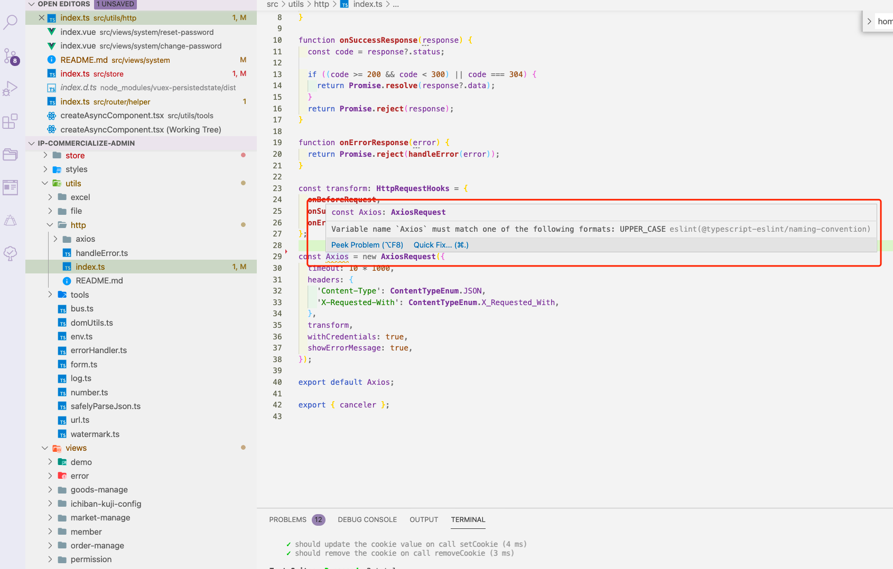
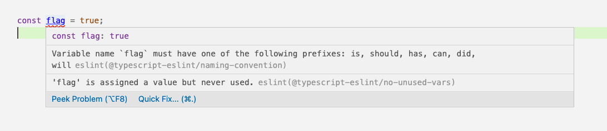

# 命名规范

由历史原因及个人习惯引起的命名不统一，导致不同成员在维护同一页面时，效率低下，迭代、维护成本极高。

### 目录命名

**全部采用小写方式， 以中划线分隔，有复数结构时，要采用复数命名法， 缩写不用复数**

✅ 正例：`components / utils / layouts / styles / card-item`
❌ 反例：`Utils / demoStyles / demo_styles / cardItem`

### 组件文件命名

**全部采用`大驼峰`方式，有复数结构时，要采用复数命名法， 缩写不用复数**

比如 `src/components` 下的组件文件命名

✅ 正例：`FreeDialog / FreeException / FreeForm / FreeFullscreen / FreeIcon`
❌ 反例：`free-dialog / free-exception / free-form / free-fullscreen / free-icon`

### Style 命名

**全部采用小写方式， 以中划线分隔**

✅ 正例：`element-override.css / common.scss`
❌ 反例：`elementOverride.css / Common.scss`

### Image 命名

**全部采用小写 `kebab-case` 命名方式， 以中划线分隔**

✅ 正例：`icon-home.png / logo.png`
❌ 反例：`iconHome.png / icon_home / Logo.png`

### Javascript 命名

**js / ts 文件统一全部采用小写方式或者小驼峰 `lowerCamelCase` 风格**

✅ 正例：`http.js / loadImage.ts / isString.ts`
❌ 反例：`Http.js / load-image.scss / is_string.ts`

**方法名、参数名、成员变量、局部变量都统一使用小驼峰 `lowerCamelCase` 风格，必须遵从驼峰形式**

✅ 正例：`hasAccess / getUserInfoById() / currentUserId`

**其中 method 方法命名必须是 `动词` 或者 `动词+名词` 形式**

✅ 正例：`saveShopCarData /openShopCarInfoDialog`
❌ 反例：`save / open / show / go`

特此说明，增删查改，详情统一使用如下 5 个单词，不得使用其他（目的是为了统一）

`add / update / delete / detail / get`

**附： 函数方法常用的动词:**

```
get 获取 / set 设置,
add 增加 / remove 删除
create 创建 / destory 移除
start 启动 / stop 停止
open 打开 / close 关闭
read 读取 / write 写入
load 载入 / save 保存
create 创建 / destroy 销毁
begin 开始 / end 结束
backup 备份 / restore 恢复
import 导入 / export 导出
split 分割 / merge 合并
inject 注入 / extract 提取
attach 附着 / detach 脱离
bind 绑定 / separate 分离
view 查看 / browse 浏览
edit 编辑 / modify 修改
select 选取 / mark 标记
copy 复制 / paste 粘贴
undo 撤销 / redo 重做
insert 插入 / delete 移除
add 加入 / append 添加
clean 清理 / clear 清除
index 索引 / sort 排序
find 查找 / search 搜索
increase 增加 / decrease 减少
play 播放 / pause 暂停
launch 启动 / run 运行
compile 编译 / execute 执行
debug 调试 / trace 跟踪
observe 观察 / listen 监听
build 构建 / publish 发布
input 输入 / output 输出
encode 编码 / decode 解码
encrypt 加密 / decrypt 解密
compress 压缩 / decompress 解压缩
pack 打包 / unpack 解包
parse 解析 / emit 生成
connect 连接 / disconnect 断开
send 发送 / receive 接收
download 下载 / upload 上传
refresh 刷新 / synchronize 同步
update 更新 / revert 复原
lock 锁定 / unlock 解锁
check out 签出 / check in 签入
submit 提交 / commit 交付
push 推 / pull 拉
expand 展开 / collapse 折叠
begin 起始 / end 结束
start 开始 / finish 完成
enter 进入 / exit 退出
abort 放弃 / quit 离开
obsolete 废弃 / depreciate 废旧
collect 收集 / aggregate 聚集
```

**常量命名全部大写，单词间用下划线隔开，力求语义表达完整清楚，不要嫌名字长**

> 这边的常量名不局限于 js 基本类型，也可以是引用类型，比如`Array`，`Object`，`Set`，`Map` 等

✅ 正例：`MAX_STOCK_COUNT`
❌ 反例：`MAX_COUNT`

如果是下面这种类型的，检查报错，就直接 `disabled`



解决方案：

```ts
// eslint-disable-next-line @typescript-eslint/naming-convention
const Axios = new AxiosRequest({
  timeout: 10 * 1000,
  headers: {
    'Content-Type': ContentTypeEnum.JSON,
    'X-Requested-With': ContentTypeEnum.X_Requested_With,
  },
  transform,
  withCredentials: true,
  showErrorMessage: true,
});
```

**TS 类型名称命名全部采用大驼峰 `KebabCase` 命名**

✅ 正例：

```ts
export type Fn = () => void;

export interface UserInfo {
  name: string;
  age: number;
}
```

❌ 反例：

```ts
export type fn = () => void;

export interface userInfo {
  name: string;
  age: number;
}
```

**`boolean` 类型名称命名除了按照正常的命名规范来，需要加上前缀 `is, should, has, can, did, will` 命名**

否则 `eslint` 检查会报错



解决方案：

```js
const isFlag = true;
```

## JavaScript 编码规范

具体的规范可以查看  [JavaScript 编码规范]
