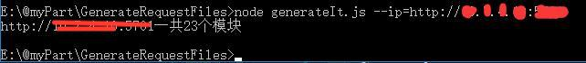
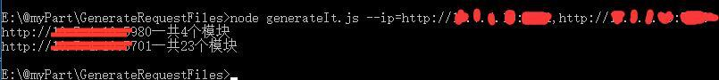
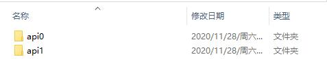
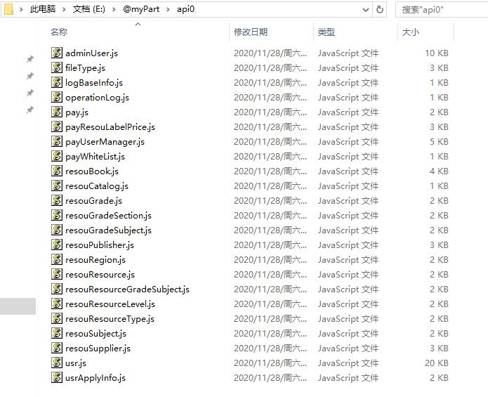
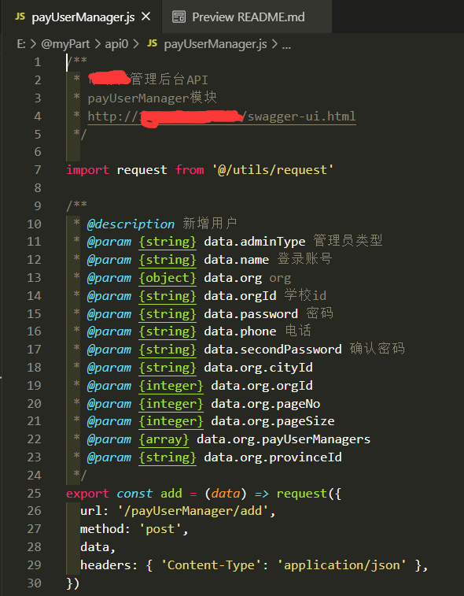

# GenerateRequestFiles

根据后端提供的swagger生成接口配置文件（JavaScript文件）
【简单的说，就是“一键”生成api目录】

## 目录

- [用法](#用法)
- [效果图](#效果图)
- [一些注意事项](#一些注意事项)
- [已发现的问题](#已发现的问题)
- [最后](#最后)

---

## <a name="用法">用法</a>

现有参数

1. ip 参数（多个 ip/域名 用 , 分割） **必填**
2. excludes 参数（多个 url 用 , 分割）
    【目前做法是：接口 url 的**开头** 和 excludes 的内容作比较】
3. includes 参数（多个url 用 , 分割）
    【目前做法是：接口 url 的**开头** 和 includes 的内容作比较】
    如果传入了这个参数，只处理以这些url开头的接口地址

假设 swagger 的地址是 <http://255.255.255.255:3000/swagger-ui.html> ，只需要取前面部分就可以了（即 ip 加端口：<http://255.255.255.255:3000> ，域名的同理）

一个 ip/域名 的情况下：
`node generate-it.js --ip=http://255.255.255.255:3000`

多个 ip/域名 的情况下（使用,来分割）：
`node generate-it.js --ip=http://255.255.255.255:3000,http://255.255.255.254:1000`

某些 url 开头的接口**不处理**（使用,来分割）：
`node generate-it.js --ip=http://255.255.255.255:3000 --excludes=/gen,/test`

**只处理**某些 url 开头的接口（使用,来分割）：
`node generate-it.js --ip=http://255.255.255.255:3000 --includes=/gen,/test`

---

## <a name="效果图">效果图</a>

---

## <a name="一些注意事项">一些注意事项</a>

1. （重要的事情说三遍）

    **生成之前会先删掉文件夹里面的内容**，受影响的话，请把内容移动到其他文件夹！！！

    **生成之前会先删掉文件夹里面的内容**，受影响的话，请把内容移动到其他文件夹！！！

    **生成之前会先删掉文件夹里面的内容**，受影响的话，请把内容移动到其他文件夹！！！

 

2. 生成的文件夹是和 generate-it.js 在同一目录下的

 

3. 生成代码之后会有一句提示：“某个域名一共n个模块”

    这个【模块】是按【请求url】来划分的，比如：

    **/adminUser**/test、**/adminUser**/jest
    这两个就属于一个模块（adminUser模块）

    **/adminUser**/test、**/test**/adminUser
    这两个就属于两个模块（adminUser模块，test模块）

    

 

4. 生成的文件夹是【不一定】有顺序的

    【因为请求返回的顺序无法控制，先返回的先处理】

    文件夹名称暂定是api加索引（api0、api1、…apiN）

    

 

5. 因为是根据swagger来生成的配置文件，后端对接口描述越详细越好

    我们这里的后端提供的swagger对接口描述的不是特别详细（比如图中有的字段没有描述）...

    下面的图中的请求参数的类型使用的是swagger上后端定的类型，我没有去处理...

    

 

6. 还有就是！`import request from '@/utils/request'`这一句我暂时是写死的

7. 方法名 或 url 发现重复的话，会拼接时间戳，如果还是重复的话，会有重复的提示语

    1. “计算url后仍然重复：url为 \$\{url\}，请求方式为 \$\{method\}”（不会保存，即不会覆盖）

    2. “处理函数名后，还有重复！！”（不会保存，即不会覆盖）

---

## <a name="已发现的问题">已发现的问题/可优化的问题：</a>

1. 注释里的 请求参数的类型 使用的是后端定的类型；如果没定义，会显示unknown；

    如果后端对参数类型描述不准确，得人力去改…

2. 生成的文件夹是和 generate-it.js 在同一目录下的

3. request文件的引入和命名，暂时是写死的（`import request from '@/utils/request'`）

4. **导出文件这种类型的接口（返回值是文件），需要自己添加`responseType: 'blob'`**

5. ~~函数的方法名可能会出现JavaScript的关键字~~

    【目前处理方式：如果有关键字，拼接url中倒数第二段字符串，否则拼接时间戳】

6. ~~函数名 或 url 发现重复的话，【目前处理方式：拼接时间戳】，处理后如果还是重复的话，会有重复的提示语：~~

    1. “计算url后仍然重复：url为 \$\{url\}，请求方式为 \$\{method\}”（不会保存，即不会覆盖）

    2. “处理函数名后，还有重复！！”（不会保存，即不会覆盖）

7. （~~感谢 [@JamLin29](https://github.com/JamLin29) 提的[issue](https://github.com/littleHiuman/GenerateRequestFiles/issues/1)）~~

   1. 需要node版本14以上【已修复，8.17.0以上可用】

   2. 域名只能写ip【已修复，ip/域名可以包含数字字母等】

---
